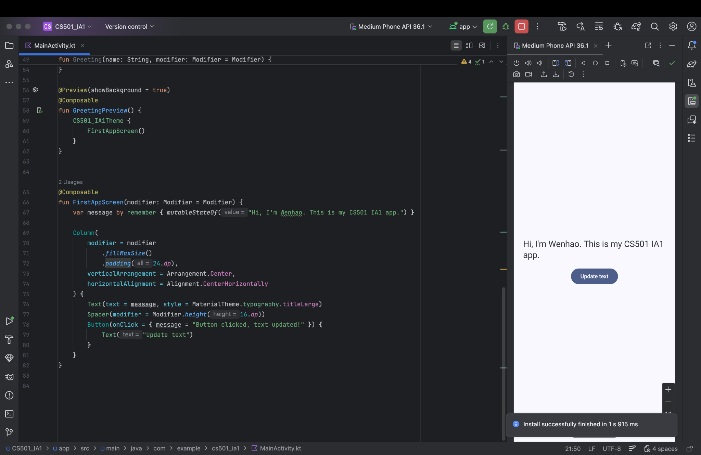

# CS501 Individual Assignment 1

## What the app does
This is a simple Jetpack Compose app written in Kotlin.
It displays a personal message and includes a button. When the button is pressed, the text updates.

## Screenshot

## Device / Emulator / SDK
- Emulator: Medium Phone API 36.1 (Android Studio Emulator)
- Android API Level: 36 (API 36.1 system image)
- Android Studio: Android Studio Otter 3 Feature Drop | 2025.2.3
- Build: AI-252.28238.7.2523.14688667 (built on Jan 9, 2026)
