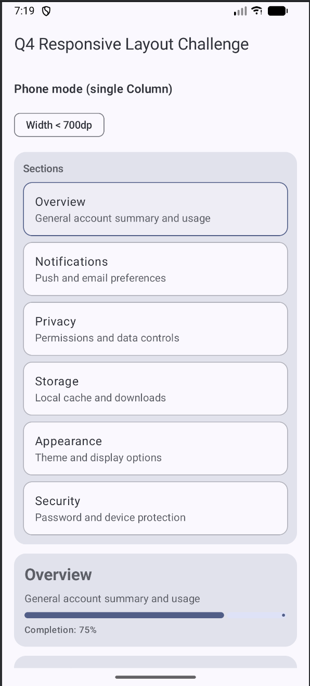

# CS501 IA3 - Q4 Responsive Layout Challenge: Phone vs Tablet

**Student:** Wenhao Wang  
**Assignment:** Individual Assignment 3 (Q4)  
**Question:** Responsive Layout Challenge: Phone vs Tablet

## Overview
This project implements a responsive screen that adapts layout based on available width using Jetpack Compose and Material 3.

The screen changes between:
- **Phone mode (narrow width):** single `Column` layout
- **Tablet/Landscape mode (wide width):** `Row` layout with two panes

---

## Q4 Requirements Addressed

### Layout Requirements
- ✅ On narrow screens (phone): uses a single `Column` layout
- ✅ On wide screens (tablet/landscape): switches to a `Row` with two panes
  - Left pane: navigation/options list (`Column` / `ListItem`)
  - Right pane: detail content using `Box + Column` composition
- ✅ Uses `BoxWithConstraints` (or width-based logic) to detect layout size and switch UI

### Material 3 Requirements (6+ total)
This screen uses Material 3 components including:
- `TopAppBar`
- `Card`
- `ListItem`
- `Switch`
- `AssistChip`
- `LinearProgressIndicator`
- `Button`
- `FilledTonalButton`
- `OutlinedButton`
- `Text`

### Modifier Requirements
This screen demonstrates:
- `weight()` to allocate width between panes in wide mode
- `fillMaxHeight()` for pane layout behavior
- `fillMaxWidth()` and `padding(...)` for responsive spacing
- at least one scrolling approach:
  - `verticalScroll(...)` and/or `LazyColumn(...)`

---

## Responsive Behavior
- Uses a width breakpoint (for example, `maxWidth < 700.dp`) to determine compact vs wide layout
- Phone mode and tablet/landscape mode are implemented with different compositions

---

## Screenshot

> Note: This screenshot may show the phone layout. The app also supports a two-pane tablet/landscape layout at wider widths.

---

## How to Run
1. Open the project in **Android Studio**
2. Sync Gradle if prompted
3. Run on an emulator or Android device
4. Test both:
   - Phone / portrait mode
   - Tablet or landscape mode (wider width)
5. Make sure `MainActivity.kt` displays the Q4 screen composable

---

## AI Disclosure
I used ChatGPT as a coding assistant for: debugging Compose layout issues (Row/Column/BoxWithConstraints/modifiers)

---

## Repository Link
<!-- Replace with your actual Q4 repo link -->
https://github.com/JefferyWenhaoWang/cs501-ia3-q4
